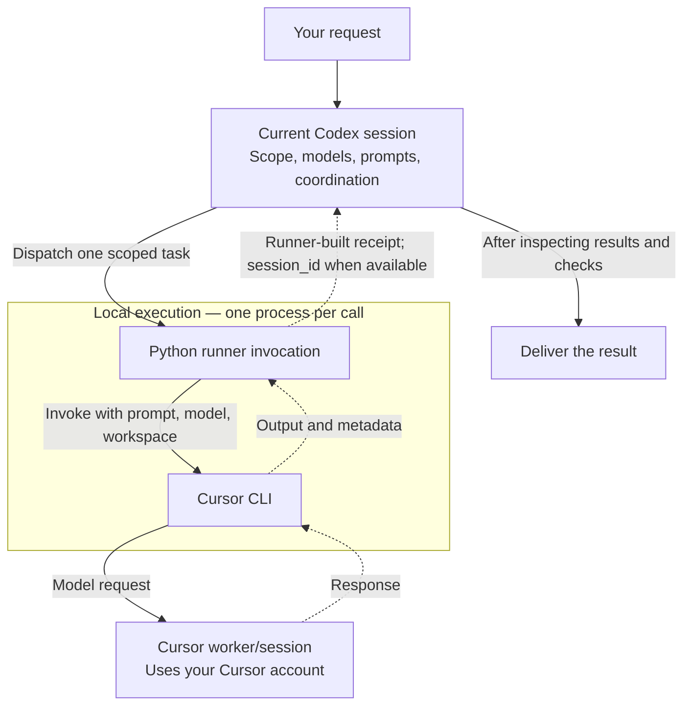
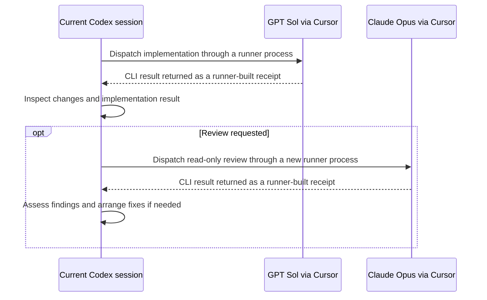

<div align="center">

# Cursor Agent Skills

### Keep the coordination in Codex. Give each task its own Cursor agent.

[](./skills)
[](https://cursor.com/docs/cli/overview)
[](./shared/cursor_runner.py)
[](https://github.com/merttcetn/cursor-agent-skills/actions/workflows/tests.yml)

[How it works](#how-it-works) · [Install](#installation) · [Choose models](#model-selection) · [Use](#usage) · [Resume](#continue-the-same-agent-session)

</div>

---

Two reusable Codex skills for delegating implementation, research, and review through **Cursor CLI**. Use Grok for a scoped task, or assign different third-party models to different roles: GPT Sol for implementation, Claude Opus for review, Gemini for research—or another model available in your Cursor account.

> **Choose the model for the work. Keep the plan, handoffs, and final decision in one Codex conversation.**

```text
Implementasyonu GPT Sol, incelemeyi Claude Opus ile cursor-subagent-3rd üzerinden yap.
```

English equivalent:

```text
Use cursor-subagent-3rd with GPT Sol for implementation and Claude Opus for review.
```

## Why this exists

Delegation should let you choose where work runs without moving the whole conversation. These skills give Codex a repeatable handoff: a self-contained prompt, an explicit model, a scoped workspace, and a JSON receipt with the result and session metadata when available.

The two entry points share one Python implementation. Each invocation starts a separate runner process for one Cursor CLI call, so fixes to execution, receipts, and prompt handling stay in one place.

| Skill | Model choice | Example |
|---|---|---|
| [`grok-subagent`](./skills/grok-subagent/SKILL.md) | Defaults to `cursor-grok-4.6-high-fast`; verify availability first | “Use Grok to implement this endpoint.” |
| [`cursor-subagent-3rd`](./skills/cursor-subagent-3rd/SKILL.md) | Requires an exact third-party model ID from the account's live list | “Implement with GPT Sol, review with Claude Opus.” |

## How it works

The diagram shows **one delegated call**. Codex chooses the model, prepares the prompt, and starts the runner. The runner invokes Cursor, converts its output into a receipt, and returns that receipt to Codex.



Solid arrows show requests and actions; dotted arrows show returned data. **Codex schedules the work.** The runner executes one CLI call and formats its result; it does not choose lanes, launch sibling agents, or schedule reviews.

For independent tasks, Codex starts separate runner processes in parallel. A single worker is also valid. Implementation, research, and review are roles chosen for the task, not mandatory stages. To continue a worker, Codex starts another invocation with `--resume <session_id>`, the same workspace, and the selected model; see [session continuation](#continue-the-same-agent-session).

**Delegated model calls use your Cursor account and its applicable usage limits.** Choosing GPT through this runner still uses Cursor; it does not start a native Codex worker. Choosing Claude does not start Claude Code or a separate provider API client.

**Main coordination continues in your existing Codex session**, consuming that session's usage for planning, prompt preparation, inspection, and synthesis. This project does not promise zero Codex usage, free delegation, lower total cost, or a measured speedup.

Workers do not inherit the Codex conversation. Each prompt must include the relevant context, workspace, owned files, constraints, and definition of done. Workers must preserve others' edits and must not launch nested agents.

## Requirements

- **Python 3.10+**, using only the standard library. No `pip install` required.
- **Codex with local skill support** for the conversational workflow.
- **Cursor CLI**, authenticated through `agent login` or the `CURSOR_API_KEY` environment variable, for real delegation.
- Access to the requested models in your Cursor account.
- A filesystem that supports directory symlinks for the included installer.

The scripts use Python filesystem APIs, without hard-coded user paths or `/tmp` dependencies. macOS and Linux support the installation approach; Windows needs directory symlink permission, such as Developer Mode. The shell examples below use a POSIX shell; in PowerShell, invoke the same Python scripts with your own paths.

See Cursor's [installation guide](https://cursor.com/docs/cli/installation) and [CLI parameter reference](https://cursor.com/docs/cli/reference/parameters) for setup and supported options. CLI flags and model availability may change; `agent --help` and `agent models` describe your installed version and account.

## Installation

From a local checkout:

```bash
cd /path/to/cursor-agent-skills
python3 scripts/install.py --dry-run
python3 scripts/install.py
```

Or clone the repository from GitHub:

```bash
git clone https://github.com/merttcetn/cursor-agent-skills.git
cd cursor-agent-skills
python3 scripts/install.py
```

The installer creates two symlinks in `${CODEX_HOME:-$HOME/.codex}/skills`, pointing to this checkout's skill folders. Both wrappers resolve the same `shared/cursor_runner.py` through their real paths.

**Keep the checkout in place.** Do not copy individual skill folders with a generic skill installer: the shared runtime lives outside them. Updating the checkout updates both installed skills. To relocate it, uninstall the links first, move the checkout, then install again.

For a custom destination:

```bash
python3 scripts/install.py --skills-dir /path/to/skills
```

Installation is idempotent for links already owned by this checkout. If either name is an existing directory or a foreign symlink, the script refuses before changing either skill. There is no overwrite flag. Existing local installations remain intact; test the package with a separate destination or explicitly relocate your old copies before switching.

Start a new Codex session if the skills are not yet visible.

### Uninstall

```bash
python3 scripts/uninstall.py --dry-run
python3 scripts/uninstall.py
# For a custom installation, use the same --skills-dir as installation.
```

Uninstall removes only matching links owned by this checkout. It preserves the repository, unrelated skills, and existing installations it does not own. Repeated uninstall is safe.

## Model selection

Discover the models available to your account:

```bash
agent models
# Alternative:
agent --list-models
```

Natural-language names such as **GPT Sol**, **Claude Opus**, or **Gemini** are resolved against that list. They are not literal CLI IDs. The runner passes the selected ID to Cursor; it does not implement discovery or automatically substitute another model.

The third-party skill preserves the requested family, version, effort, thinking, and fast preferences. With an unversioned family, it prefers the newest clearly versioned listed release; unspecified effort prefers high, then medium, then unqualified. It prefers non-fast and, for Claude, non-thinking unless requested otherwise. These are **skill selection rules**, not claims about Cursor defaults.

If the requested model or modifier is unavailable, the coordinator asks for a choice instead of silently switching providers. Grok has a default ID, but account availability must still be checked. Third-party dispatch always requires `--model`; `auto`, `default`, Grok, and Composer are rejected by that entry point.

## Usage

### Assign implementation and review to different models

```text
$cursor-subagent-3rd

Use GPT Sol to implement the settings page.
Once implementation is complete, use Claude Opus for a read-only review
of the changes and test coverage. Resolve findings and report the checks run.
```

Codex resolves both model IDs, dispatches implementation, inspects its receipt, then starts the reviewer against the completed changes. Review depends on implementation, so those stages run sequentially.



This is one possible workflow. Each dispatch and return uses the runner shown above. Codex initiates both stages; workers do not dispatch one another. Any requested fixes and final checks remain under Codex's coordination.

### Delegate to Grok

```text
$grok-subagent

Implement pagination in the API module. Keep the existing response schema,
add the relevant checks, and report changed files and validation results.
```

### Call the runner directly

From the repository root, this dry run needs neither Cursor CLI nor authentication:

```bash
python3 skills/grok-subagent/scripts/spawn_cursor_agent.py \
  --dry-run --label implementation --workspace "$PWD" \
  "Inspect the task and report your plan."
```

For real delegation, prepare a prompt using the [worker template](./skills/cursor-subagent-3rd/references/prompt-template.md), then set `SOL_MODEL` and `OPUS_MODEL` to **exact IDs from your live model list**:

```bash
RUNNER="$PWD/skills/cursor-subagent-3rd/scripts/spawn_cursor_agent.py"
WORKSPACE="/absolute/path/to/project"
TASK_DIR="$(mktemp -d)"
# Write implementation.md into TASK_DIR using the linked template.
# SOL_MODEL must contain the selected live Cursor model ID.
python3 "$RUNNER" \
  --model "$SOL_MODEL" --label implementation \
  --workspace "$WORKSPACE" \
  --prompt-file "$TASK_DIR/implementation.md" \
  --out "$TASK_DIR/implementation.json"
```

`--prompt-file` avoids shell quoting problems. `--stdin` is also supported. Long prompts are referenced by file; long inline/stdin prompts use a temporary file that the runner removes after normal completion or a handled failure. Forced process termination can leave temporary files behind.

### Run independent tasks in parallel

```text
$cursor-subagent-3rd

Use GPT Sol for the API module and Gemini for independent documentation work.
Run them in parallel. Assign disjoint file ownership and agree on the API
contract first. Review both results before integrating them.
```

The runner handles one worker per process. To dispatch two independent prompts directly:

```bash
# Prepare api.md and docs.md first; select SOL_MODEL and GEMINI_MODEL from agent models.
python3 "$RUNNER" --model "$SOL_MODEL" --label api \
  --workspace "$WORKSPACE" --prompt-file "$TASK_DIR/api.md" \
  --out "$TASK_DIR/api.json" &
api_pid=$!

python3 "$RUNNER" --model "$GEMINI_MODEL" --label docs \
  --workspace "$WORKSPACE" --prompt-file "$TASK_DIR/docs.md" \
  --out "$TASK_DIR/docs.json" &
docs_pid=$!

api_status=0; wait "$api_pid" || api_status=$?
docs_status=0; wait "$docs_pid" || docs_status=$?
printf 'API exit: %s; docs exit: %s\n' "$api_status" "$docs_status"
```

Use unique prompt and receipt paths per lane. Parallel writers need disjoint ownership and a shared contract; do not have workers edit the same files concurrently. For isolated Git work, `--worktree [name]` and `--worktree-base <ref>` are available. Inspection and integration of those worktrees remain the coordinator's responsibility.

## Continue the same agent session

A successful JSON response may include `session_id`. Save the receipt and use that ID to assign follow-up work to **the same Cursor session**:

```bash
SESSION_ID="$(python3 -c 'import json,sys; d=json.load(open(sys.argv[1])); assert d.get("ok") and d.get("session_id"), "No successful resumable session"; print(d["session_id"])' "$TASK_DIR/implementation.json")"

# Write followup.md, then keep the same workspace and selected model.
python3 "$RUNNER" \
  --model "$SOL_MODEL" --resume "$SESSION_ID" --label implementation-followup \
  --workspace "$WORKSPACE" \
  --prompt-file "$TASK_DIR/followup.md" \
  --out "$TASK_DIR/followup.json"
```

Reusing a label alone does not resume anything. Use `--resume`, retain the selected model unless the user asks to change it, and do not submit simultaneous follow-ups to one session. For a worker created in a worktree, use that existing worktree as the resume workspace; do not pass `--worktree` again.

Receipts record the **requested** model, not independent evidence of server-side model execution. A missing session ID is not a confirmed resumable session. In text output mode, the runner cannot extract session metadata.

## Runner behavior

| Option | Behavior |
|---|---|
| `--mode agent` | Default. Can edit and run commands; passes `--force` with sandbox enabled. |
| `--mode ask` | Requests Cursor's ask mode for research/review; also forbid edits in the task prompt. |
| `--mode plan` | Requests planning mode; use for explicitly requested planning. |
| `--sandbox disabled` | Explicitly disables the agent-mode sandbox. |
| `--approve-mcps` | Opts into auto-approval of configured MCP servers. Omitted by default. |
| `--add-dir PATH` | Adds another workspace root; repeatable where supported by the installed CLI. |
| `--timeout SECONDS` | Bounds the CLI subprocess wait; returns exit code 124 on timeout. |
| `--out PATH` | Writes a JSON receipt, including for dry runs and handled execution failures. |
| `--dry-run` | Builds a preview with prompt contents redacted; makes no Cursor call. |

The runner passes `--trust` for headless workspace access. These flags do not expand the user's authorization: worker prompts must retain task scope. Ask/plan modes and file ownership instructions are not a replacement for filesystem access controls.

Authentication is inherited from Cursor login or the environment. The runner never reads credential files and does not accept an API key argument. Prompts and model results may contain private project information: keep runtime receipts outside version control and do not put secrets into prompts. No user credentials or runtime transcripts are included in this repository.

Receipts contain `ok`, `is_error`, `model`, `mode`, `workspace`, `label`, and the result, with session metadata when Cursor supplies it. Invalid/empty JSON or a reported error is treated as failure even if the CLI exits zero. Worker-level outcomes such as `needs_input` remain in the result and must be inspected; a successful CLI call does not prove the task is complete.

On a timeout or failure, inspect partial work before retrying. Stopping the CLI is not a rollback or a guarantee that remote work or descendant processes have stopped. Missing CLI, authentication failures, and unavailable models should be reported without silently moving execution to another provider.

## Validation status

**Automated offline tests pass. Live validation is limited to one read-only review.**

The included tests cover dry-run commands, explicit model selection, resume arguments, prompt handling, mocked receipts and timeouts, entry-point execution, and install/uninstall behavior in temporary directories. Mocks are synthetic test fixtures; they are not recorded model runs.

```bash
python3 -m unittest discover -s tests -v
```

The 18-test suite passed locally on macOS. All six hosted jobs also passed on Linux, macOS, and Windows with Python 3.10 and 3.13 in the [verified offline CI run](https://github.com/merttcetn/cursor-agent-skills/actions/runs/34690730205). Symlink-dependent tests skip on hosts without symlink permission.

On September 12, 2026, one real `--mode ask` call through this package completed a read-only README review with the requested model ID `gpt-5.6-sol-xhigh`. It returned a result and session ID, and a before/after file hash comparison confirmed that repository files were unchanged. This confirms that particular dispatch and receipt path on the tested account; the receipt records the requested model, not independent proof of server-side model execution.

Live editing, other models, parallel calls, remote session continuation, plan mode, MCP behavior, sandbox enforcement, and worktree execution remain unverified. No performance or billing benchmarks are claimed.

## Repository layout

```text
cursor-agent-skills/
├── skills/
│   ├── grok-subagent/
│   │   ├── SKILL.md
│   │   ├── agents/openai.yaml
│   │   ├── references/prompt-template.md
│   │   └── scripts/spawn_cursor_agent.py
│   └── cursor-subagent-3rd/
│       └── … same structure
├── shared/cursor_runner.py       # One execution implementation
├── scripts/
│   ├── install.py
│   ├── uninstall.py
│   └── manage_skills.py
├── tests/
│   ├── test_runner.py
│   └── test_install.py
└── .github/workflows/tests.yml
```

## License

No license has been selected yet. A license file and license badge are intentionally absent; licensing terms remain pending the repository owner's decision.

---

<div align="center">

One conversation for coordination. Explicit models for delegated work. Sessions you can continue.

</div>
